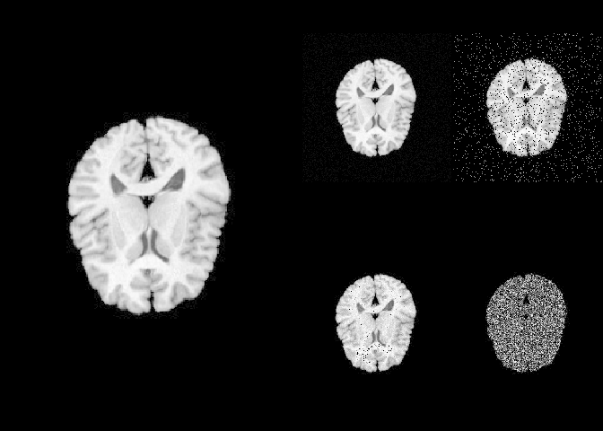

<!-- README.md is generated from README.Rmd. Please edit that file -->

# rpyANTs

<!-- badges: start -->

[](https://CRAN.R-project.org/package=rpyANTs)
[](https://github.com/dipterix/rpyANTs/actions/workflows/R-CMD-check.yaml)
<!-- badges: end -->

`rpyANTs` is a package that ports `ANTsPy`, a `Python` implementation of
`ANTs` into R using R-Python interpreter package `reticulate`.

## Installation

The installation requires one-line extra setup

``` r
install.packages("rpyANTs")

# set up ANTs
rpyANTs::install_ants()
```

`install_ants` creates an isolated `Python` environment managed by
[`RAVE`](https://rave.wiki/). This environment does not conflict nor
affect any existing Python installations.

## How to use

To load `ANTs`

``` r
library(rpyANTs)

# Whether ANTs is available
ants_available()

# Load ANTs into R
ants
```

In R, we use `$` to get module functions or class members. For example:

``` r
ants$add_noise_to_image
#> <ANTs Python Wrapper>
#> Help on function add_noise_to_image in module ants.utils.add_noise_to_image:
#> 
#> add_noise_to_image(image, noise_model, noise_parameters)
#>     Add noise to an image using additive Guassian, salt-and-pepper,
#>     shot, or speckle noise.
#>     
#>     ANTsR function: `addNoiseToImage`
#>     
#>     Arguments
#>     ---------
#>     image : ANTsImage
#>         scalar image.
#>     
#>     noise_model : string
#>         'additivegaussian', 'saltandpepper', 'shot', or 'speckle'.
#>     
#>     noise_parameters : tuple or array or float
#>         'additivegaussian': (mean, standardDeviation)
#>         'saltandpepper': (probability, saltValue, pepperValue)
#>         'shot': scale
#>         'speckle': standardDeviation
#>     
#>     Returns
#>     -------
#>     ANTsImage
#>     
#>     Example
#>     -------
#>     >>> import ants
#>     >>> image = ants.image_read(ants.get_ants_data('r16'))
#>     >>> noise_image = ants.add_noise_to_image(image, 'additivegaussian', (0.0, 1.0))
#>     >>> noise_image = ants.add_noise_to_image(image, 'saltandpepper', (0.1, 0.0, 100.0))
#>     >>> noise_image = ants.add_noise_to_image(image, 'shot', 1.0)
#>     >>> noise_image = ants.add_noise_to_image(image, 'speckle', 1.0)
#> 
#> 
#> 
#> *** Above is documentation for Python. Please use `$` in R accordingly
#> <function add_noise_to_image at 0x1125ab820>
```

The following R code translates Python code into R:

``` r
# >>> img = ants.image_read(ants.get_ants_data('r16'))
img <- ants$image_read(ants$get_ants_data('r16'))

# >>> noise_image1 = ants.add_noise_to_image(img, 'additivegaussian', (0.0, 1.0))
noise_image1 <- ants$add_noise_to_image(
  img, 'additivegaussian', 
  noise_parameters = tuple(0.0, 1.0)
)

# >>> noise_image2 = ants.add_noise_to_image(img, 'saltandpepper', (0.1, 0.0, 100.0))
noise_image2 <- ants$add_noise_to_image(
  img, 'saltandpepper', 
  noise_parameters = tuple(0.1, 0.0, 100.0)
)

# >>> noise_image3 = ants.add_noise_to_image(img, 'shot', 1.0)
noise_image3 <- ants$add_noise_to_image(
  img, 'shot', 
  noise_parameters = 1.0
)

# >>> noise_image4 = ants.add_noise_to_image(img, 'speckle', 1.0)
noise_image4 <- ants$add_noise_to_image(
  img, 'speckle', 
  noise_parameters = 1.0
)
```

To load imaging data into R

``` r
orig_array <- img$numpy()
noise_array1 <- noise_image1$numpy()
noise_array2 <- noise_image2$numpy()
noise_array3 <- noise_image3$numpy()
noise_array4 <- noise_image4$numpy()

# plot via R
layout(matrix(c(1,1,2,3,1,1,4,5), nrow = 2, byrow = TRUE))
par(mar = c(0.1, 0.1, 0.1, 0.1), bg = "black", fg = "white")
pal <- grDevices::gray.colors(256, start = 0, end = 1)

image(orig_array, asp = 1, axes = FALSE, 
      col = pal, zlim = c(0, 255))
image(noise_array1, asp = 1, axes = FALSE, 
      col = pal, zlim = c(0, 255))
image(noise_array2, asp = 1, axes = FALSE, 
      col = pal, zlim = c(0, 255))
image(noise_array3, asp = 1, axes = FALSE, 
      col = pal, zlim = c(0, 255))
image(noise_array4, asp = 1, axes = FALSE, 
      col = pal, zlim = c(0, 255))
```



# Known issues

TODO: Integers, numeric

TODO: tuple, list, …

TODO: class operators

TODO: type conversion

TODO: documentation

# Citation

TBA

# License

Apache-2.0
