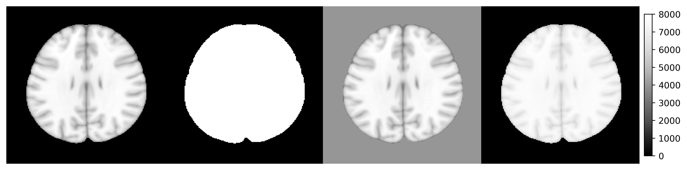

<!-- README.md is generated from README.Rmd. Please edit that file -->

# rpyANTs

<!-- badges: start -->

[](https://CRAN.R-project.org/package=rpyANTs)
[](https://github.com/dipterix/rpyANTs/actions/workflows/R-CMD-check.yaml)
<!-- badges: end -->

`rpyANTs` was detached from a `RAVE` ([Reproducible Analysis and
Visualization of `iEEG`](https://openwetware.org/wiki/RAVE)) module. It
is now a standalone package that connects `ANTsPy` with R using seamless
shared-memory.

This package was originally created for the following three purposes:

- Portability
  - Make `ANTs` easily accessible from the latest R and all major
    operating systems
  - Allow `RAVE` or other code/scripts/frameworks to be reproducible
    since the code will be OS-invariant
- Easy to install
  - Automated installation that requires very little to no knowledge
    about compilers
  - Installing `rpyANTs` takes less than 10 minutes
  - The goal is to have minimum human intervention
- Easy to embed
  - Python scripts using `ANTsPy` can be executed from `rpyANTs` and R
    with no modification
  - Built-in bilateral data conversions between Python and R allows
    image generated from Python to be analyzed/visualized in R and vice
    versa

> Disclaimer: This is a third-party maintained R package for `ANTs`. If
> you are looking for the `ANTsR` package by `B.B Avants`, please check
> [here](https://github.com/ANTsX/ANTsR).

## Installation

The installation requires one-line extra setup

``` r
# Install from CRAN
install.packages("rpyANTs")

# Install from nightly dev builder
# install.packages("rpyANTs", repos = "https://dipterix.r-universe.dev")


# set up ANTs
rpyANTs::install_ants()
```

`install_ants` creates an isolated `Python` environment managed by
`RAVE`. This environment does not conflict nor affect your existing
Python installations.

### Upgrade `ANTs`

To upgrade `ANTs`, first update `rpyANTs`, then upgrade `ANTsPyx`

``` r
install.packages("rpyANTs")
rpymat::add_packages(packages = "antspyx", pip = TRUE)
```

## How to use

To load `ANTs`

``` r
library(rpyANTs)

# Whether ANTs is available
ants_available()

# Load ANTs into R
ants
```

In R, we use `$` to get module functions or class members. For example:

``` r
ants$add_noise_to_image
#> <ANTs Python Wrapper>
#> Help on function add_noise_to_image in module ants.utils.add_noise_to_image:
#> 
#> add_noise_to_image(image, noise_model, noise_parameters)
#>     Add noise to an image using additive Guassian, salt-and-pepper,
#>     shot, or speckle noise.
#>     
#>     ANTsR function: `addNoiseToImage`
#>     
#>     Arguments
#>     ---------
#>     image : ANTsImage
#>         scalar image.
#>     
#>     noise_model : string
#>         'additivegaussian', 'saltandpepper', 'shot', or 'speckle'.
#>     
#>     noise_parameters : tuple or array or float
#>         'additivegaussian': (mean, standardDeviation)
#>         'saltandpepper': (probability, saltValue, pepperValue)
#>         'shot': scale
#>         'speckle': standardDeviation
#>     
#>     Returns
#>     -------
#>     ANTsImage
#>     
#>     Example
#>     -------
#>     >>> import ants
#>     >>> image = ants.image_read(ants.get_ants_data('r16'))
#>     >>> noise_image = ants.add_noise_to_image(image, 'additivegaussian', (0.0, 1.0))
#>     >>> noise_image = ants.add_noise_to_image(image, 'saltandpepper', (0.1, 0.0, 100.0))
#>     >>> noise_image = ants.add_noise_to_image(image, 'shot', 1.0)
#>     >>> noise_image = ants.add_noise_to_image(image, 'speckle', 1.0)
#> 
#> *** Above documentation is for Python. 
#> *** Please use `$` instead of `.` for modules and functions in R
#> <function add_noise_to_image at 0x112480790>
```

The following R code translates Python code into R:

``` r
# >>> img = ants.image_read(ants.get_ants_data('r16'))
img <- ants$image_read(ants$get_ants_data('r16'))

# >>> noise_image1 = ants.add_noise_to_image(img, 'additivegaussian', (0.0, 1.0))
noise_image1 <- ants$add_noise_to_image(
  img, 'additivegaussian', 
  noise_parameters = tuple(0.0, 1.0)
)

# >>> noise_image2 = ants.add_noise_to_image(img, 'saltandpepper', (0.1, 0.0, 100.0))
noise_image2 <- ants$add_noise_to_image(
  img, 'saltandpepper', 
  noise_parameters = tuple(0.1, 0.0, 100.0)
)

# >>> noise_image3 = ants.add_noise_to_image(img, 'shot', 1.0)
noise_image3 <- ants$add_noise_to_image(
  img, 'shot', 
  noise_parameters = 1.0
)

# >>> noise_image4 = ants.add_noise_to_image(img, 'speckle', 1.0)
noise_image4 <- ants$add_noise_to_image(
  img, 'speckle', 
  noise_parameters = 1.0
)

# >>> trans = ants.create_ants_transform(
# >>>   dimension=2, matrix=[[0.707, 0.707], [-.707, 0.707]],
# >>>   translation=[-53, 128])
trans <- as_ANTsTransform(matrix(
  c(0.707, 0.707, -53,
    -0.707, 0.707, 128),
  nrow = 2, byrow = TRUE
), dimension = 2)


# >>> noise_image4 = trans.apply_to_image(noise_image4)
noise_image4 <- trans$apply_to_image(noise_image4)
```

To load imaging data into R

``` r
# Use [] to convert ANTsImage into R array
is.array(img[])
#> [1] TRUE

# plot via R
layout(matrix(c(1,1,2,3,1,1,4,5), nrow = 2, byrow = TRUE))
par(mar = c(0.1, 0.1, 0.1, 0.1), bg = "black", fg = "white")
pal <- grDevices::gray.colors(256, start = 0, end = 1)

image(img[], asp = 1, axes = FALSE, 
      col = pal, zlim = c(0, 255), ylim = c(1, 0))
image(noise_image1[], asp = 1, axes = FALSE, 
      col = pal, zlim = c(0, 255), ylim = c(1, 0))
image(noise_image2[], asp = 1, axes = FALSE, 
      col = pal, zlim = c(0, 255), ylim = c(1, 0))
image(noise_image3[], asp = 1, axes = FALSE, 
      col = pal, zlim = c(0, 255), ylim = c(1, 0))
image(noise_image4[], asp = 1, axes = FALSE, 
      col = pal, zlim = c(0, 255), ylim = c(1, 0))
```


## Advanced use case

### Run/Debug `Python` scripts

`rpyANTs` ports functions that allows to run `Python` scripts. For
example:

``` r
library(rpyANTs)

script_path <- tempfile(fileext = ".py")
writeLines(con = script_path, text = r"(

# This is Python script
import ants
print(ants.__version__)

)")

run_script(script_path)
```

You can also run `Python` interactive in R (yes, you are correct).
Simply run

``` r
rpyANTs::repl_python()
```

The console prefix will change from `>` to `>>>`, meaning you are in
`Python` mode:

    > rpyANTs::repl_python()
    Python 3.8.16 (/Users/dipterix/Library/r-rpymat/miniconda/envs/rpymat-conda-env/bin/python3.8)
    Reticulate 1.26 REPL -- A Python interpreter in R.
    Enter 'exit' or 'quit' to exit the REPL and return to R.
    >>> 

Try some Python code!

    >>> import ants
    >>> help(ants.registration)

To exit Python mode, type `exit` (no parenthesis) and hit enter key

    >>> exit
    > 

### Data conversions

Native R variables can be easily converted to `Python` and back via
`r_to_py` and `py_to_r`.

For example

``` r
# R to Python
r_to_py(1)
#> 1.0
r_to_py(1L)
#> 1

# Python to R
py_obj <- py_list(1:3)
class(py_obj)  # <- this is a python object
#> [1] "python.builtin.list"   "python.builtin.object"

py_to_r(py_obj)
#> [1] 1 2 3
```

You can also use variables created in R from Python or vice versa:

In the following example, an R object `object_r` is created. In Python,
it can be accessed (read-only) via `r.object_r`

    > object_r <- c(1,2,3)
    > repl_python()
    Python 3.8.16 (/Users/dipterix/Library/r-rpymat/miniconda/envs/rpymat-conda-env/bin/python3.8)
    Reticulate 1.26 REPL -- A Python interpreter in R.
    Enter 'exit' or 'quit' to exit the REPL and return to R.
    >>> r.object_r
    [1.0, 2.0, 3.0]

Similarly, a Python object `object_py` is created, and it can be read
from `py$object_py`:

    >>> import numpy as np
    >>> object_py = np.array([2,3,4])
    >>> exit
    > py$object_py
    [1] 2 3 4

## Known issues

### Variable types

R is not a type-rigid language. Some functions in `ANTsPy` require
specific variable types that are often vague in R. For example the
`dimension` argument in function `ants$create_ants_transform` needs to
be an integer, but R’s default numerical values are `double`. In this
case, variable formats need to be explicitly given.

Here are several examples

1.  Explicit integers

``` r
# ants$create_ants_transform(dimension = 3)     # <- error
ants$create_ants_transform(dimension = 3L)      # < XXXL is an explicit integer
```

2.  `Tuple`, `list`, and `dictionary`

A Python `tuple` is a vector that cannot alter lengths.

``` r
# Wrong as `aff_iterations` needs to be a tuple
# ants$registration(fixed, moving, ..., aff_iterations = c(6L, 4L, 2L, 1L))

ants$registration(fixed, moving, ..., aff_iterations = tuple(6L, 4L, 2L, 1L))
```

Similar conversions can be done via `py_list`, `py_dict`.

3.  Convert `TRUE` vs. `FALSE`

A Python module can be imported with auto-conversion (argument
`convert`) set to `TRUE` or `FALSE`. When auto-conversion is on, the
Python function results will be converted to R objects automatically.
For example,

``` r
np <- import("numpy", convert = TRUE)
np$eye(4L)
#>      [,1] [,2] [,3] [,4]
#> [1,]    1    0    0    0
#> [2,]    0    1    0    0
#> [3,]    0    0    1    0
#> [4,]    0    0    0    1
```

The `numpy` array is automatically translated as an R matrix. While this
is convenient, this automated conversion could cause some issues when
the function results are further passed into another Python function.
For example, the following code will raise errors.

``` r
> np <- import("numpy", convert = TRUE) 
> ants <- load_ants()
> 
> image <- ants$image_read(ants$get_ants_data('mni'))
> image_array <- np$asarray(list(image, image))
> 
> ants$plot_grid(image_array, slices = 100L)

Error in py_call_impl(callable, dots$args, dots$keywords) :
Matrix type cannot be converted to python (only integer, numeric, complex, logical, and character matrixes can be converted
```

The error is raised because `numpy` has `convert=TRUE`, hence
`image_array` is converted to an R list with each element being a
`ANTsImage` instance. Calling `ants$plot_grid` needs R-to-Python
conversion for all input variables, including `image_array`. However
this conversion makes `image_array` a Python list instead of `numpy`
array, violating the input format.

A safer way is to keep in the Python format, i.e. `convert=FALSE`. In
this mode, function results will not be converted back to R (you need to
manually make conversion by yourself via `py_to_r`). Now the following
example works.

``` r
> np <- import("numpy", convert = TRUE) 
> ants <- load_ants()
> 
> image <- ants$image_read(ants$get_ants_data('mni'))
> image_array <- np$asarray(list(image, image))
> 
> ants$plot_grid(image_array, slices = 100L)
```

> Object `ants` in `rpyANTs` is a non-conversion Python module. Object
> `py` is a auto-conversion Python module

### Operators

In Python, operators on `ANTsImage`, such as `img > 5` are defined. Such
operators is being supported in R as `S3` generic functions. Don’t worry
if you don’t know what is `S3` generic, see the following examples:

``` r
library(rpyANTs)
image <- ants$image_read(ants$get_ants_data('mni'))
print(image)
dim(image)
range(image)

y1 <- (image > 10) * 8000

y2 <- image
y2[y2 < 10] <- 4000

y3 <- log(image + 1000)
y3 <- (y3 - min(y3)) / (max(y3) - min(y3)) * 8000

ants_plot_grid(
  list(image, y1, y2, y3),
  slices = 100, shape = c(1, 4),
  vmin = 0, vmax = 8000
)
```



Although the operator generics have been implemented for common classes
such as `ANTsImage` and `ANTsTransform`. Many are still under
development and not supported. In this case, you might want to use the
following workaround methods. You are more than welcome to post a
wish-list or issue ticket to the [`Github`
repository](https://github.com/dipterix/rpyANTs/issues)

Alternative version 1: call operators directly

``` r
library(rpyANTs)
image <- ants$image_read(ants$get_ants_data('r16'))

# The followings are the same
# threshold <- image > 10
threshold <- image$`__gt__`(10)
ants$plot(threshold)
```

Work-around version 2: If you don’t know how Python operators work, use
Python directly

``` r
library(rpyANTs)
image <- ants$image_read(ants$get_ants_data('r16'))

# Create an R variable from Python!
py_run_string("r.threshold = r.image > 10", local = TRUE, convert = FALSE)
ants$plot(threshold)
```

## Citation

This is a general citation for `ANTs`:

> Avants, B.B., Tustison, N. and Song, G., 2009. Advanced normalization
> tools (ANTS). The Insight Journal, 2(365), pp.1-35.

If you are using `rpyANTs` through `RAVE`, please also cite:

> Magnotti, J.F., Wang, Z. and Beauchamp, M.S., 2020. RAVE:
> Comprehensive open-source software for reproducible analysis and
> visualization of intracranial EEG data. NeuroImage, 223, p.117341.

## License

This package `rpyANTs` is released under Apache-2.0 license (Copyright:
Zhengjia Wang). The underlying `ANTsPy` is released under Apache-2.0
license (Copyright: ANTs contributors).
